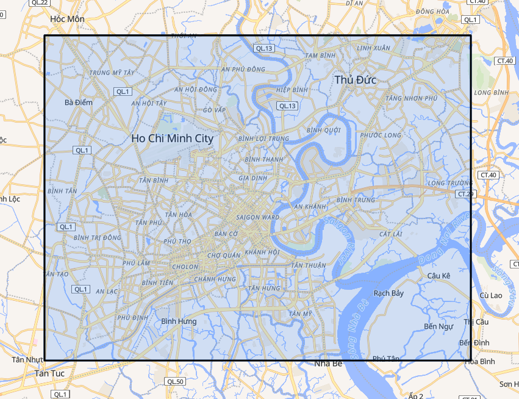

# AI Traffic Routing Bot

Mô tả ngắn gọn:
- Hệ thống backend độc lập cung cấp API định tuyến giao thông tối ưu bằng cách sử dụng những con hẻm cho khu vực nội thành Thành phố Hồ Chí Minh.
- Xử lý dữ liệu OSM offline để dựng đồ thị định tuyến, lưu trữ artifacts địa lý và phục vụ các truy vấn đường đi qua một REST API.
- Có thể sử dụng trực tiếp với Telegram: tìm @TrafficRouting_bot và nhập `/start` để bắt đầu. Cách sử dụng khuyên dùng là nhấn vào nút **Menu (Mini App)** ở góc dưới bên trái để mở trực tiếp giao diện bản đồ trực quan. Ngoài ra, bạn vẫn có thể dùng cách cũ là nhập lệnh `/route` và gửi tọa độ chia sẻ vị trí để tìm đường.

## Yêu cầu trước khi cài đặt
- Python 3.12.x (Hiện đang sử dụng)
- `osmium-tool` để trích/lọc file .osm.pbf
- Cài đặt các thư viện trong `requirements.txt`

## Cài đặt

### 1. Cài đặt python và thư viện
- Khuyến khích tạo và sử dụng .venv nội bộ trước khi cài đặt
```bash
python -m venv .venv
```
- Active .venv
- Cài đặt thư viện
```bash
pip install -r requirements.txt
```

### 2. Tải dữ liệu OSM gốc

- Tải file OpenStreetMap (PBF) từ Geofabrik (ví dụ: `vietnam-latest.osm.pbf`) và đặt vào `data/`.

### 3. Trích vùng nội thành HCMC

```bash
osmium extract -b 106.58,10.70,106.82,10.88 data/vietnam-latest.osm.pbf -o data/hcmc_urban_core.osm.pbf
```
Có thể truy cập https://bboxfinder.com/ để xem phạm vi


### 4. Lọc chỉ giữ dữ liệu đường (highway tags)

```bash
osmium tags-filter data/hcmc_urban_core.osm.pbf w/highway -o data/hcmc_routing_clean.osm.pbf --overwrite
```

### 5. Xây dựng artifacts offline và các bước phụ trợ

Thư mục `scripts/` chứa các công cụ tiền xử lý và sinh artifacts. Thứ tự gợi ý để tái tạo dữ liệu offline (các bước có thể điều chỉnh theo dữ liệu hiện có):

1. Xây dựng đồ thị định tuyến chính:

```bash
python -m scripts/build_offline_graph.py
```
Kết quả:
- `data/hcmc_routing_brain_v1.pkl`
- `data/hcmc_geometry_store.feather`

2. Lấy dữ liệu các trạm trong phạm vi:

```bash
python scripts/setup_master_data.py
```
Kết quả:
- `data/master_stops.json`

3. Chuẩn hóa master data, map segments lên graph, xây dựng route stop sequence:

```bash
python scripts/build_segment_lengths.py
python scripts/map_segments_to_graph.py
python scripts/build_route_stop_sequence.py
```
Kết quả:
- `data/segment_lengths_v1.json`
- `data/segment_lengths_v2.json`
- `data/route_stop_sequence.json`

4. Đóng gói graph (tạo "brain" V2) kèm theo góc rẽ phạt:

```bash
python scripts/bake_graph_brain.py
python scripts/inspect_brain.py
```
Kết quả:
- `data/hcmc_routing_brain_v2.pkl`
- `data/turn_penalties.pkl`


## Cấu hình môi trường

- Thông tin cấu hình và secrets lưu trong `.env` (xem `.env.example`).
- `HOT_DB` (dữ liệu động) trỏ đến MongoDB Atlas (cloud.mongodb.com).
- `COLD_DB` (dữ liệu tĩnh/artifacts) được lưu/đồng bộ sang Hugging Face Dataset hoặc có thể thiết lập để giữ trong `data/` nếu muốn triển khai tại máy cá nhân.

## Chạy ứng dụng

```bash
# đặt .env, cài dependencies
uvicorn app.main:app --host 0.0.0.0 --port 7860
```

Hoặc dùng Docker:

```bash
docker build -t traffic-routing-bot .
docker run --env-file .env -p 7860:7860 traffic-routing-bot
```

Hoặc triển khai tự động lên HuggingFace Spaces:
- Tạo Space mới (môi trường Docker), thiết lập các biến môi trường `.env` trên giao diện web.
- Thêm remote git của Hugging Face với tên `hf` (ví dụ: `git remote add hf https://huggingface.co/spaces/...`).
- Chạy script PowerShell tự động đóng gói và deploy (script sẽ tự tạo nhánh ảo, chỉ lựa chọn đẩy code và các file data V2 thiết yếu để tránh tràn dung lượng LFS):
  ```powershell
  .\scripts\deploy_hf.ps1
  ```

## Kiến trúc và thành phần chính

- `app/main.py`: entrypoint, khởi tạo FastAPI, lifespan hooks (nạp các file artifacts lên RAM).
- `app/api/routes.py`: định nghĩa endpoint REST (health, routing API, v.v.).
- `app/core`: cấu hình và logger.
- `app/models/schemas.py`: schema request/response.
- `app/services/routing/`
    - `map_builder.py`: chứa các hàm nạp file artifacts.
    - `pathfinder.py`: thuật toán tìm đường trên đồ thị đã xử lý (graph search, heuristics).
    - `service.py`: chứa các hàm gọi thuật toán hay chuyển đổi giá trị phục vụ cho api routing.
- `app/services/traffic/traffic_manager.py`: điều chỉnh chi phí cạnh theo dữ liệu thời gian thực.
- `app/services/crawler/`: thu thập dữ liệu lịch trình và dữ liệu thời gian thực (bus crawler, scheduler).
- `app/services/storage/`: tải dữ liệu đã cào lên các nơi lưu trữ.
- `scripts/`: các tool phân tích, tiền xử lý offline artifacts và kịch bản triển khai hệ thống (deploy_hf.ps1).

## Dữ liệu và artifacts

- `data/hcmc_routing_clean.osm.pbf`: OSM data đã lọc ban đầu.
- `data/hcmc_routing_brain_v1.pkl`: đồ thị định tuyến gốc (trung gian).
- `data/hcmc_geometry_store.feather`: geometry store phục vụ trích xuất tọa độ địa lý.
- `data/master_stops.json`: danh sách toàn bộ các trạm xe buýt.
- `data/segment_lengths_v1.json`: khoảng cách vật lý của các đoạn đường (trung gian).
- `data/segment_lengths_v2.json`: kết quả sau khi đã nội suy và ánh xạ (map matching) các trạm dừng lên đồ thị định tuyến.
- `data/route_stop_sequence.json`: thứ tự các trạm của từng tuyến xe buýt.
- `data/hcmc_routing_brain_v2.pkl`: đồ thị định tuyến bản hoàn thiện (đã được tiêm trọng số cơ bản và đánh dấu ưu tiên xe buýt).
- `data/turn_penalties.pkl`: trọng số phạt thời gian khi rẽ/quay đầu.
- `HOT_DB`: phục vụ cho việc tính toán trọng số tức thời, TTL được cài đặt là 60 phút.
- `COLD_DB`: phục vụ cho việc thống kê và huấn luyện mô hình AI dự đoán cho tương lai.

## Tích hợp với Telegram (hiện trạng)

- Tách Telegram Bot ra khỏi hệ thống, biến hệ thống này trở thành một api thuần phục vụ cho việc tìm đường.
- Telegram Bot được tách riêng thành repo: https://github.com/AnhDucwcs/telegram-bot-satellite
- Repo Bot gọi API tìm đường của hệ thống này; hệ thống trả kết quả về callback URL của repo Telegram.
- Repo này hiện được triển khai trên Render và hoạt động liên tục.

## Triển khai

- Mục tiêu chính: Hugging Face Spaces (sử dụng Dockerfile cung cấp). Hot DB trên MongoDB Atlas; cold DB đồng bộ lên Hugging Face Dataset hoặc lưu trong `data/`.

## Ghi chú kỹ thuật (tóm tắt phương pháp)

- Pipeline:
    1. Dùng `osmium` để trích/lọc PBF → `hcmc_routing_clean.osm.pbf`.
    2. Dùng script `build_offline_graph.py` (kết hợp OSMnx / networkx hoặc logic nội bộ) để dựng đồ thị và xuất pickle/feather. Lý do sử dụng .pkl là để giải quyết việc không đủ RAM cho việc chuyển đổi .pbf thành .graphml.
    3. Sinh thêm bảng/chỉ số hỗ trợ (segment lengths, route stop sequences) bằng các script tương ứng.
    4. Khi trả lời truy vấn routing, `pathfinder` vận hành trên đồ thị đã tiền xử lý và có thể điều chỉnh chi phí cạnh bằng dữ liệu thời gian thực từ `traffic_manager`.

- Routing:
    1. Thiết kế hàm heuristic theo đường chim bay, kết quả trả về là thời gian tốt nhất với vận tốc chung là 45km/h.
    2. Thiết kế hàm custom_astar_path sử dụng các trọng số phạt đã được hệ thống tính toán trước, sử dụng min heap để tăng tốc.
    3. Hàm find_shortest_path sử dụng custom_astar_path để tìm đường, hàm custom_astar_path được đặt trong asyncio.to_thread để tránh CPU-Bound.

- Crawling Bus Data:
    1. Đọc danh sách các bến xe trong phạm vi nội thành từ `data/master_stops.json`.
    2. Sử dụng api_1 https://apicms.ebms.vn/prediction/predictbystopid/{stop_id} và `data/segment_lengths_v2.json` để tìm và trích xuất thông tin của xe buýt trong phạm từ trạm trước đó đến trạm hiện tại (chọn 1 xe gần nhất). Các xe có vận tốc bằng 0 sẽ được kiểm tra, nếu xe cách trạm hiện tại dưới 60m thì sẽ bỏ qua vì có thể xe đang dừng đón/trả khách (đảm bảo an toàn nếu đang có nhiều xe buýt hoặc dữ liệu GPS chưa cập nhật kịp thời).
    3. Sử dụng api_2 https://apicms.ebms.vn/prediction/{route_id}/{var_id}/{stop_id}/predictnextstops/1 để lấy thông tin dự đoán cho `1` trạm xe tiếp theo tính từ trạm hiện tại. 
    4. Khi sử dụng api_2 sẽ kiểm tra đúng biển số xe buýt để đảm bảo tránh lệch thông tin.
    5. Giá trị vận tốc khi đẩy lên `HOT_DB` sẽ được tính bằng cách lấy giá trị trung bình vận tốc của các xe trong segment ({pre_stop_id}_{cur_stop_id}) hiện tại thay vì lựa chọn giá trị nhỏ nhất để có thểm tính chính xác cho dữ liệu.
    6. Kết quả từ api_1 đã đủ để sử dụng, có thể đẩy lên `HOT_DB`. Tuy nhiên để có dữ liệu phục vị cho việc thống kê hay huấn luyện mô hình AI sau này thì cần `COLD_DB` dựa trên kết quả tính toán sau khi có dữ liệu từ api_2.
    7. Sử dụng một proxy Việt Nam để tránh bị API chặn khi triển khai lên HF. Hệ thống cào dữ liệu sẽ được hoạt động từ 5h30 đến 21h30, khi ngoài thời gian này, hệ thống cào sẽ tiến hành ngủ để tránh lãng phí.

## Tổng kết

Hiện tại hệ thống đã ở trạng thái có thể chạy như một backend độc lập trên Docker/Hugging Face Spaces, với dữ liệu nóng và lạnh được phân vai rõ ràng. Phần Telegram đã được chuyển sang repo satellite để đảm bảo khả năng hoạt động độc lập, liên tục.

Hệ thống đã có thể cho ra con đường tối ưu hơn bằng cách sử dụng các con hẻm, tuy nhiên cần phải cập nhật thêm các trọng số phạt để có thể tăng độ chính xác và độ linh hoạt của hệ thống khi tìm đường.

Hiện đang sử dụng Telegram là nền tảng chính để tương tác. Để khắc phục điểm yếu của tính năng `chia sẻ vị trí` truyền thống (gây khó khăn khi tìm địa điểm), hệ thống đã tích hợp thêm **Telegram Mini App** thông qua Custom Menu Button. Nâng cấp này mở ra một giao diện web bản đồ trực tiếp ngay trong Telegram, giúp người dùng thao tác chọn điểm đi và điểm đến trực quan, từ đó tối ưu hóa hoàn toàn trải nghiệm sử dụng.

Hệ thống hiện tại vẫn chưa đảm bảo có thể đáp ứng nhiều người dùng cùng lúc.

---

## Tuyên bố miễn trừ trách nhiệm

Dự án này được phát triển cho mục đích **nghiên cứu học thuật và phi lợi nhuận**. 

- **Nguồn dữ liệu:** Hệ thống thực hiện thu thập dữ liệu giao thông công cộng thông qua các API công khai từ `https://apicms.ebms.vn`. 
- **Quyền sở hữu:** Tôi không sở hữu, không thay đổi và không thương mại hóa dữ liệu được thu thập từ nguồn này. Mọi quyền sở hữu trí tuệ đối với dữ liệu gốc thuộc về đơn vị cung cấp dịch vụ tương ứng.
- **Mục đích:** Việc cào dữ liệu chỉ nhằm mục đích tối ưu hóa lộ trình và phục vụ nhu cầu cá nhân/nghiên cứu. Hệ thống không thực hiện các hành vi gây tải quá mức (DDoS) hoặc làm gián đoạn dịch vụ của bên cung cấp.
- **Liên hệ:** Nếu đơn vị quản lý API phát hiện các vấn đề liên quan đến việc sử dụng dữ liệu hoặc mong muốn tôi gỡ bỏ/chỉnh sửa cách thức thu thập, vui lòng liên hệ với tôi qua [lnanhduc12@gmail.com] hoặc mở một [Issue] trên repository này. Tôi cam kết sẽ phản hồi và xử lý yêu cầu gỡ bỏ hoặc điều chỉnh ngay lập tức.

Người sử dụng mã nguồn này phải tự chịu trách nhiệm về việc tuân thủ các điều khoản dịch vụ (Terms of Service) của các bên thứ ba khi triển khai hệ thống.
