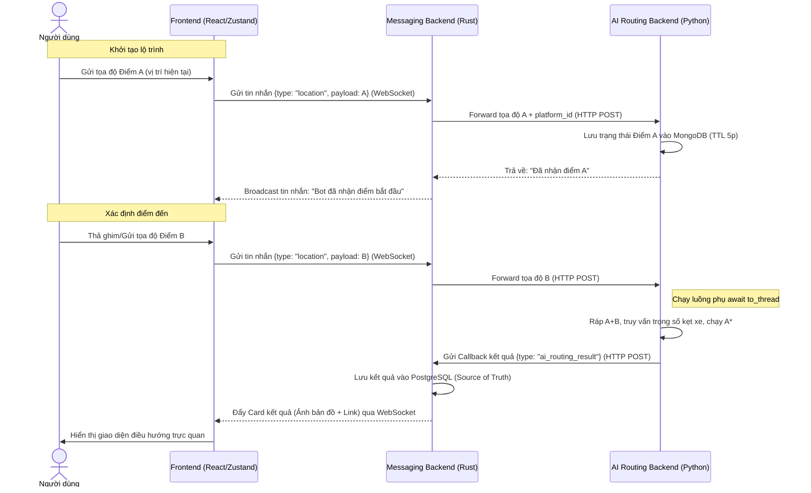
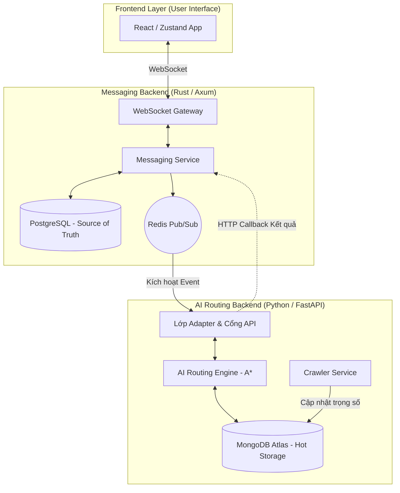

## 1. Mục tiêu (Objective & Problem Statement)
**Vấn đề:** Người tham gia giao thông tại TP.HCM thiếu một công cụ liên lạc kết hợp với khả năng tìm đường "luồn hẻm" thực tế. Việc chuyển đổi qua lại giữa App chat và App bản đồ gây gián đoạn trải nghiệm.
**Giá trị mang lại (Tầm nhìn & Giải pháp):** Xây dựng nền tảng nhắn tin Real-time có khả năng nhận thức không gian (Spatial-aware). Người dùng có thể vừa giao tiếp (Chat 1-1, Chat nhóm), vừa nhận được lộ trình né kẹt xe tối ưu ngay trong giao diện nhắn tin thông qua Trợ lý AI Zero-Cost.
**Mục tiêu Kỹ thuật:** Đảm bảo độ trễ nhắn tin nội bộ < 200ms, đồng thời duy trì khả năng tính toán lộ trình phức tạp của AI dưới 3 giây mà không làm nghẽn luồng WebSocket (Event Loop) của hệ thống Chat.

---

## 2. Ràng buộc và phạm vi

> [!warning] Ràng buộc hệ thống & Phạm vi tích hợp (Constraints & Scope) 
>  - **Ràng buộc Kiến trúc Phân tán:** Hệ thống bị chia cắt vật lý: Server Chat (Rust/NodeJS) xử lý realtime, trong khi Lõi AI (Python) nằm trên Hugging Face Spaces. Yêu cầu giao tiếp chéo môi trường bắt buộc phải có cơ chế Webhook/Callback bất đồng bộ để không khóa luồng hệ thống Chat.
>  - **Ràng buộc Chi phí & Tài nguyên AI:** Phân hệ AI dùng chiến lược "Zero-Cost API", deploy trên Hugging Face (16GB RAM) kết hợp MongoDB M0. API cào dữ liệu xe buýt bắt buộc dùng Proxy tĩnh VN để vượt lỗi 403.
>  - **Ràng buộc Hiệu năng Chat:** Phân hệ Chat phải đảm bảo tỷ lệ mất tin nhắn ~ 0% (Message loss rate) và hỗ trợ kiến trúc mở rộng (Horizontal scaling) từ 10k concurrent connections.
>  - **Phạm vi Địa lý:** AI Routing chỉ hỗ trợ tính toán trong "Vùng lõi phục vụ" nội thành TP.HCM để tối ưu đồ thị RAM.

> [!info] Phạm vi tính năng cốt lõi (Unified MVP Scope - Phase 1)
> **Phân hệ Nền tảng nhắn tin (Messaging Core):**
> - **Hệ thống tài khoản:** Đăng ký, đăng nhập (Auth JWT), quản lý định danh `user_id`.
> - **Giao tiếp Real-time:** Chat 1-1 qua WebSocket, đảm bảo lưu trữ bền vững (PostgreSQL).
> - **Tính năng Vị trí:** Bắt buộc hỗ trợ định dạng payload `type: location` để gửi tọa độ GPS hiện tại.
> 
> **Phân hệ Trợ lý AI (Routing Service):**
> - **Nhận diện Ngữ cảnh:** Tự động kích hoạt khi Chat Server forward tọa độ (Location) sang.
> - **Routing Engine:** Chạy thuật toán A* bằng đồ thị cắt giảm hình học (`.pkl` trên RAM) và dữ liệu kẹt xe cào từ xe buýt (Lưu Hot DB).
> - **Output:** Trả về định dạng text thuần kèm URL dẫn hướng Google Maps.

> [!info] **Mở rộng Độ tin cậy & Trải nghiệm (Phase 2):** 
> - **Messaging:** Cập nhật trạng thái tin nhắn (Delivery/Seen status), cơ chế Offline Sync, và chiến lược Retry (Idempotency) khi gửi lỗi.
> - **AI Routing:** Quản lý State Machine tự động dọn dẹp bộ nhớ (TTL 5 phút), AI tự sinh ảnh bản đồ tĩnh Folium trả về.
> - **Giao diện (UI):** Frontend render được thẻ tin nhắn đặc biệt (Card UI) cho `ai_routing_result` để hiển thị bản đồ trực tiếp trong đoạn chat.


---

## 3. Luồng người dùng & Trải nghiệm (User Flow)

Trong hệ sinh thái tích hợp, luồng trải nghiệm không còn bó hẹp trong Webhook của Telegram mà là sự phối hợp giữa luồng thời gian thực (WebSocket) và luồng xử lý tính toán (HTTP Callback).
	



> [!abstract] Đặc điểm trải nghiệm người dùng
> 
> - **Tính nhất quán:** Người dùng cảm nhận Bot như một thành viên trong cuộc hội thoại (System User). Mọi trạng thái tính toán được cập nhật liên tục qua WebSocket để giảm cảm giác chờ đợi.
>     
> - **Giao diện trực quan (Card UI):** Thay vì nhận link text thô, hệ thống trả về một thẻ tin nhắn chuyên dụng chứa ảnh tĩnh lộ trình. Người dùng chỉ cần một chạm để mở ứng dụng điều hướng gốc trên điện thoại.
>     
> - **Xử lý ngắt quãng:** Nhờ việc lưu trạng thái (State) vào MongoDB của AI Bot, nếu người dùng lỡ tay thoát App Chat giữa lúc gửi điểm A và B, phiên làm việc vẫn được giữ lại trong vòng 5 phút.
>     

---

Dưới đây là nội dung **Mục 4: Kiến trúc Hệ thống & Luồng Dữ liệu (Architecture & Data Flow)** được tinh chỉnh để khớp với mô hình phân tán giữa Server Chat (Rust) và Server AI (Python/Hugging Face).

---

## 4. Kiến trúc Hệ thống & Luồng Dữ liệu (Architecture & Data Flow)

Hệ thống được thiết kế theo mô hình **Kiến trúc hướng dịch vụ (Service-Oriented Architecture)** để đảm bảo tính độc lập giữa lõi nhắn tin và lõi tính toán AI.

### 4.1. Sơ đồ Kiến trúc Tổng thể (High-Level Architecture)




### 4.2. Đặc tả Giao kèo API (API Integration Contract)

Để hai hệ thống "hiểu" nhau mà không bị phụ thuộc vào công nghệ của nhau, mọi trao đổi dữ liệu phải tuân thủ JSON Schema sau:

**A. Payload gửi từ Chat Server sang AI Bot:**

- **Endpoint:** `POST /api/chat/app`
- **Cấu trúc:**

```
{
  "user_id": "app_user_001",
  "platform": "internal_app",
  "session_id": "unique_uuid_per_routing_task",
  "location": {
    "lat": 10.762622,
    "lng": 106.660172
  }
}
```

**B. Payload phản hồi từ AI Bot về Chat Server (Callback):**

- **Endpoint:** `POST /api/callback/routing`
- **Cấu trúc:**

```
{
  "conversation_id": "uuid",
  "sender_id": "0000-0000-0000-0000", 
  "type": "ai_routing_result",
  "payload": {
      "image_url": "https://huggingface.co/.../map.png",
      "navigation_url": "https://www.google.com/maps/dir/...",
      "instruction": "Lộ trình tối ưu qua các hẻm né kẹt xe đã sẵn sàng."
  }
}
```

### 4.3. Quản lý Dữ liệu & Phiên làm việc (Data & Session Management)

- **Database Chat (PostgreSQL):** Lưu trữ toàn bộ lịch sử tin nhắn, bao gồm cả các tin nhắn `type: location` và kết quả trả về từ AI để đảm bảo tính đồng bộ đa thiết bị.
- **Database AI (MongoDB):** Lưu trữ dữ liệu vận tốc xe buýt ($\Delta d / \Delta t$) và trạng thái chờ (State) của các phiên tìm đường đang dang dở.
- **Định danh đa nền tảng:** Sử dụng **Platform Prefix** để quản lý Session ID.
- Ví dụ: `tele_123` cho người dùng Telegram và `app_abc` cho người dùng trên ứng dụng nhắn tin tự xây dựng. Điều này giúp lõi AI không bao giờ bị nhầm lẫn dữ liệu giữa các nền tảng khác nhau.

### 4.4. Cơ chế Xử lý Song song (Dual-Pipeline)

Hệ thống vận hành hai đường ống dữ liệu tách biệt để tối ưu tài nguyên:

1. **Luồng Online (Request-Response):** Xử lý yêu cầu tìm đường của người dùng thông qua Webhook/API. Các tác vụ nặng được đẩy vào luồng phụ (`asyncio.to_thread`) để bảo vệ cổng giao tiếp.
2. **Luồng Offline (Batch Pipeline):** Crawler chạy ngầm mỗi 5-15 phút để cập nhật "bản đồ nhiệt" giao thông vào MongoDB. Luồng này hoạt động độc lập, đảm bảo khi người dùng yêu cầu tìm đường, dữ liệu trọng số đã có sẵn trong Cache/DB.

---

## 5. Yêu cầu Phi chức năng & Quản lý Rủi ro Kỹ thuật

**Hiệu năng & Khả năng chịu tải (Performance & Scalability)**
 Sự chênh lệch về tốc độ giữa nhắn tin và tính toán AI yêu cầu các chiến lược bảo vệ chéo:
 - **Hệ thống Chat (Rust/Axum):** Yêu cầu độ trễ nội bộ (Internal Latency) **< 200ms**. Đảm bảo khả năng mở rộng ngang (Horizontal Scaling) để xử lý từ 10k đến 100k kết nối WebSocket đồng thời nhờ môi trường bất đồng bộ Tokio.
 - **Lõi AI (Python/FastAPI):** Thời gian chạy thuật toán A* trên 316.000 nodes phải **< 3 giây**. Để bảo vệ server Hugging Face không bị sập khi có nhiều request, toàn bộ khối tính toán đồ thị phải được đẩy ra luồng phụ bằng lệnh `await asyncio.to_thread(...)` hoặc `ProcessPoolExecutor`.

**Quản lý Bộ nhớ cho AI (Split Architecture)**
 Do giới hạn tài nguyên (Cloud miễn phí), hệ thống AI áp dụng **Kiến trúc Tách đôi (Split Architecture)** để tránh văng lỗi OOM (Out of Memory):
 - **Não bộ (`.pkl` - ~36MB):** Chỉ chứa Topology (Nodes, Edges) và Length. Nạp thẳng vào RAM lúc khởi động để chạy A* siêu tốc.
 - **Cơ bắp (`.feather` - ~14MB):** Chứa dữ liệu hình học (Geometry/LineString). Lưu dưới ổ cứng (Disk), chỉ tra cứu khi cần vẽ ảnh bản đồ.

**Đảm bảo Toàn vẹn Dữ liệu & Dự phòng lỗi (Fault Tolerance)**
 - **Cơ chế ACK & Idempotency (Chống trùng lặp):** Mọi tin nhắn gửi đi đều sử dụng `client_message_id`. Nếu mạng chập chờn dẫn đến Retry nhiều lần, hệ thống Chat dựa vào ID này để loại bỏ tin nhắn trùng lặp.
- **Xử lý Mất kết nối (Offline Sync):** Nếu người dùng rớt mạng (WebSocket ngắt), tin nhắn kết quả từ AI Bot vẫn được lưu an toàn vào PostgreSQL. Khi người dùng online lại, Client sẽ tự động gọi API `GET /messages?after=last_sync_timestamp` để đồng bộ.
 - **Suy giảm mượt mà (Graceful Degradation):** Nếu server AI trên Hugging Face bị sập hoặc quá tải (Timeout), Server Chat **tuyệt đối không được treo**. Nó phải bắt lỗi và tự động gửi tin nhắn phản hồi: *"Hệ thống điều hướng đang bảo trì, vui lòng thử lại sau"*.

**Xử lý giới hạn Nền tảng (Platform Limitations)**
- **Chống Ngủ đông (Anti-Sleep) cho Hugging Face:** Hệ thống thiết lập một endpoint `GET /health-check` và sử dụng Cron Job/UptimeRobot ping mỗi 5 phút để giữ luồng Crawler chạy ngầm. *(Lưu ý: Sẵn sàng phương án fallback đem Crawler về chạy local nếu bị khóa tài khoản).*
 - **Bypass Tường lửa (Firewall):** API xe buýt nội bộ chặn IP quốc tế. Lõi AI bắt buộc cấu hình `httpx.AsyncClient` đi qua **Proxy tĩnh IP Việt Nam**.

**Bảo mật Hệ thống (Security)**
- **Người dùng cuối:** Xác thực qua **JWT (JSON Web Tokens)** khi mở kết nối WebSocket.
- **Giao tiếp Server-to-Server:** Endpoint `POST /api/chat/app` giữa Rust và Python được bảo vệ bằng cơ chế Server-to-Server Authentication với Header `X-Internal-Key` (Nạp qua biến môi trường `.env` hoặc Hugging Face Secrets) để chặn các truy cập rác từ bên ngoài.

---

## 6. Tiêu chuẩn nghiệm thu (Acceptance Criteria - UAT)

**Nghiệm thu Tích hợp Cốt lõi (Core Integration UAT - Happy Path)**
- **Luồng tìm đường:** Từ giao diện Chat, người dùng gửi thành công 2 tin nhắn chứa tọa độ (`type: location`). Hệ thống Chat ghi nhận, đẩy qua AI. Trong vòng **< 5 giây**, người dùng BẮT BUỘC phải nhận được kết quả.
 - **Hiển thị giao diện:** Kết quả trả về không phải là text thô mà phải được Frontend render thành một Thẻ thông tin (Card UI) chứa ảnh lộ trình trực quan và nút bấm mở Google Maps.
 - **Tính độc lập của phiên:** Nếu User A và User B cùng gửi tọa độ yêu cầu tìm đường cùng một lúc, kết quả của người này tuyệt đối không được gửi nhầm sang khung chat của người kia (Chứng minh Session ID và cơ chế Event Dispatcher hoạt động chính xác).

**Nghiệm thu Hiệu năng & Tài nguyên (Performance UAT)**
- **Độ trễ Chat (Chat Latency):** Thời gian gửi và nhận tin nhắn văn bản thông thường giữa 2 user nội bộ hệ thống phải đạt **< 200ms**.
- **Độ trễ AI (AI Latency):** Thuật toán A* duyệt trên tập đồ thị 316.000 nodes của TP.HCM phải hoàn thành và sinh link trong **< 3 giây**.
- **Giới hạn RAM (Memory Limit):** Container FastAPI trên Hugging Face khi khởi động và nạp xong file đồ thị `routing_brain.pkl` không được tiêu thụ quá **500MB RAM**.

**Nghiệm thu Độ tin cậy & Chịu lỗi (Reliability & Fallback UAT)**
 - **Kiểm thử Sập AI Server (Service Down):** Tắt server Hugging Face. Khi người dùng gửi tọa độ, App Chat không được treo hay chờ vô hạn, phải bắt lỗi Timeout và trả về tin nhắn hệ thống: *"Dịch vụ chỉ đường hiện đang bảo trì, vui lòng thử lại sau"*.
- **Kiểm thử Sập Crawler (Cold Start):** Tắt luồng cào dữ liệu xe buýt (giả lập API Buyttphcm chết). Thuật toán A* không được văng lỗi mà phải tự động Fallback dùng trọng số tĩnh (Static Heuristics) để tiếp tục tính đường.
 - **Kiểm thử Lỗi Event Loop:** Trong lúc AI đang mất 2-3s tính toán đường cho User A, User B nhắn tin cho User C. Tin nhắn này phải được giao ngay lập tức (Chứng minh luồng Chat WebSocket và luồng AI được tách biệt hoàn toàn).
- **Kiểm thử Vùng mù (Out of Bounds):** Người dùng gửi tọa độ nằm ngoài TP.HCM (VD: Hà Nội). Lõi AI bắt lỗi bằng `try...except`, không được Crash Server, và trả về link Google Maps dẫn đường mặc định.

**Nghiệm thu Nền tảng Nhắn tin (Messaging Core UAT)**
 - **Đảm bảo chuyển phát (Delivery Guarantee):** Người dùng gửi tin nhắn khi ngắt kết nối mạng (Bật chế độ máy bay). Khi có mạng lại, Client tự động Retry đẩy tin nhắn đi, dữ liệu lưu xuống Database không bị nhân đôi (Chứng minh tính Idempotency hoạt động).
- **Đồng bộ Offline (Offline Sync):** Người dùng đăng nhập tài khoản trên thiết bị thứ 2 phải tải được đầy đủ lịch sử tin nhắn và trạng thái bản đồ từ API đồng bộ (`GET /messages`).