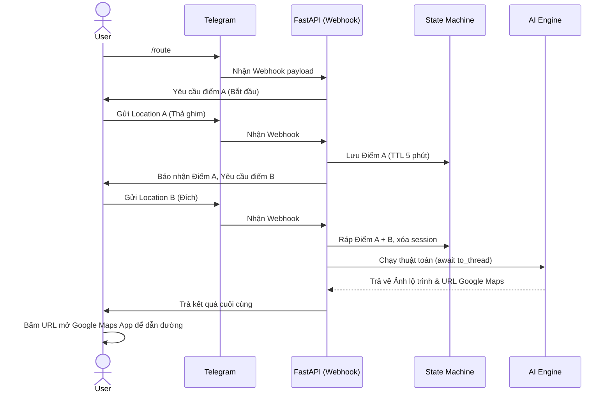
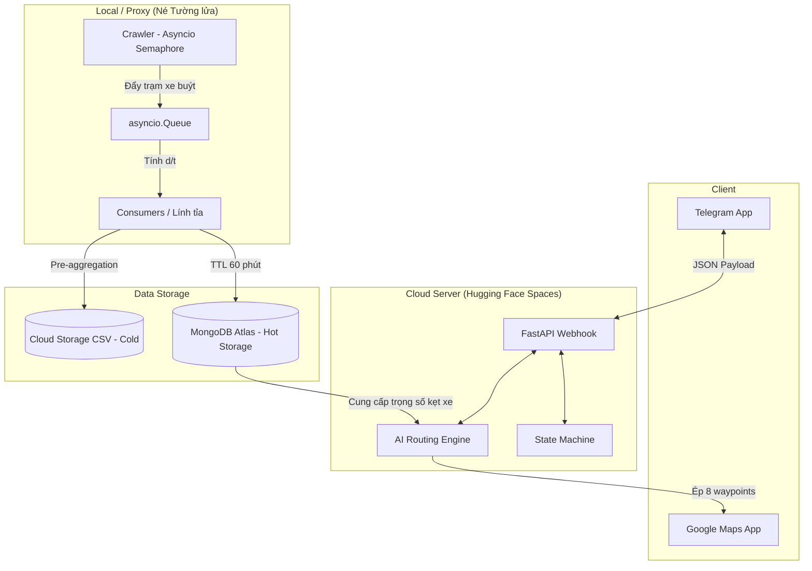
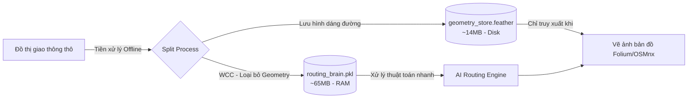

## 1. Mục tiêu (Objective & Problem Statement)
**Vấn đề:** Tình trạng ùn tắc giao thông tại TP.HCM diễn ra thường xuyên. Các ứng dụng bản đồ hiện có ưu tiên các trục đường lớn, dẫn đến việc người dùng dễ bị dồn vào các "nút thắt cổ chai". API chỉ đường thương mại có chi phí đắt đỏ.
**Giá trị mang lại:** Xây dựng Bot trợ lý giao thông thông minh giúp tài xế xe máy tìm lộ trình "luồn hẻm" né kẹt xe theo thời gian thực. Hệ thống áp dụng chiến lược tự vận hành thuật toán AI trên máy chủ Cloud miễn phí (Hugging Face Spaces) để tối ưu 100% chi phí.

---

## 2. Ràng buộc và phạm vi

> [!warning] Ràng buộc hệ thống & Phạm vi đề tài (Constraints & Scope) 
>  - **Ràng buộc về Chi phí & Hạ tầng:** Áp dụng triệt để chiến lược "Zero-Cost API". Triển khai trên Hugging Face Spaces (Môi trường Docker, 16GB RAM, 2 vCPU) hoàn toàn miễn phí. Kiến trúc lưu trữ được chia làm hai: Sử dụng MongoDB Atlas gói M0 (512MB) làm **Kho Nóng (Hot Storage)** lưu dữ liệu kẹt xe tức thời; và tận dụng 50GB ổ cứng cục bộ của Hugging Face làm **Kho Lạnh (Cold Storage)** lưu dữ liệu thống kê lịch sử dưới định dạng nén siêu nhẹ `.parquet` để tránh cạn kiệt dung lượng.
>  - **Ràng buộc Nguồn Dữ liệu:** API xe buýt chặn IP quốc tế (Lỗi 403). Bắt buộc sử dụng Proxy tĩnh tại Việt Nam (lưu trong Secrets) để Crawler trên Hugging Face có thể lấy được dữ liệu. 
>  - **Phạm vi Địa lý:** Bounding Box tập trung vào "Vùng lõi phục vụ" (Service Area) gồm các quận nội thành TP.HCM, loại bỏ vùng ngoại ô (Củ Chi, Cần Giờ) để tối ưu hóa đồ thị. Trải nghiệm ngoài vùng lõi sẽ Fallback (suy giảm mượt mà) sang Google Maps gốc.

> [!info] Phạm vi tính năng
> - **Giao diện:** Telegram Bot.
> - **Input:** Tính năng "Share Location" gốc của Telegram.
> - **State Machine:** Ghi nhớ tạm phiên chat (Lưu điểm A chờ B) với TTL 5 phút.
> - **Crawler Real-time:** Cào API xe buýt (1-5 phút/lần), tính vận tốc phát hiện kẹt xe.
> - **AI Routing Engine:** Đồ thị TP.HCM, thuật toán A*/Dijkstra với trọng số động.
> - **Đầu ra kép:** Ảnh bản đồ tĩnh (Ground Truth) + URL Google Maps (Navigation rút gọn 8-9 waypoints).
> 
**Mở rộng Đa nền tảng (Nice-to-have):** 
> - **Hệ thống Đa kênh (Multi-channel):** Backend cung cấp các API linh hoạt, tách biệt hoàn toàn lõi AI khỏi giao diện người dùng, làm tiền đề để mở rộng sang các nền tảng khác (Web App, Zalo).

> [!abstract] SỔ TAY BACKLOG V2.0: THƯƠNG MẠI HÓA & MỞ RỘNG HỆ THỐNG
> 
> **1. Nâng cấp Kiến trúc & Hiệu năng (Scaling & Architecture)**
> 
> - **Hệ thống phân tán:** Chuyển đổi từ `ProcessPoolExecutor` cục bộ sang kiến trúc phân tán chuyên nghiệp với **FastAPI (Server chính) + Redis (Message Broker) + Celery (Worker Queue)** để chịu tải hàng ngàn request cùng lúc.
> - **Tối ưu Thuật toán Tìm đường:** Nâng cấp lên **Bi-directional Dijkstra (Dijkstra hai chiều)** để thu hẹp không gian tìm kiếm, hoặc sử dụng _ kết hợp công thức Haversine_* để tối ưu hóa số lượng node cần duyệt.
> - **Chuyển đổi sang C++ hoặc Rust:** Rút trích hàm tìm đường A* và viết lại bằng **C++ (sử dụng Pybind11/Cython)** hoặc **Rust (sử dụng PyO3)** để tăng tốc độ xử lý cục bộ lên mức tối đa mà không phá vỡ kiến trúc Python hiện tại.
> - **Phục hồi Đặc trưng Đồ thị:** Khi Server có nhiều RAM hơn, nạp lại các thuộc tính **`maxspeed` và `name`** vào đồ thị để tính toán chính xác Thời gian di chuyển (Fastest Path) và sinh ra văn bản chỉ đường chi tiết.
> 
> **2. Trải nghiệm Người dùng (UX) & Đa nền tảng**
> 
> - **Hiệu ứng "Streaming Text":** Áp dụng `asyncio` và `yield` để liên tục cập nhật trạng thái tiến độ theo thời gian thực trên Telegram trong lúc chờ thuật toán xử lý.
> - **Trực quan hóa Thực tế:** Tích hợp **Headless Browser (Puppeteer/Selenium)** vào Celery worker để tự động render và chụp ảnh lộ trình Google Maps gửi về cho người dùng.
> - **Phát triển Web App riêng:** Tự xây dựng Frontend (VueJS/React) kết hợp Mapbox/Leaflet, sử dụng lại **file `.feather` (Kho chôn cất Hình học)** chứa LineString để vẽ chính xác các đường cong của hẻm lên bản đồ thay vì phụ thuộc Google Maps URL.
> - **Đa nền tảng:** Mở rộng giao diện giao tiếp sang **Zalo Bot**.
> 
> **3. Khai thác Dữ liệu Nâng cao (Computer Vision & Crawler)**
> 
> - **Thuật toán Cross-Reference:** Nâng cấp luồng Consumer để theo dõi Vehicle ID (Biển số xe), tự động gom nhóm và tính toán vận tốc `delta_d / delta_t` qua chuỗi nhiều trạm liên tiếp của cùng một chiếc xe để tăng độ chính xác.
> - **Computer Vision & GIS:** Xây dựng luồng Offline tải các mảnh bản đồ **(Traffic Tiles)** từ Google Maps, sử dụng **OpenCV** lọc dải pixel kẹt xe và áp dụng thuật toán **Map-Matching** để khớp tọa độ pixel vào cạnh đồ thị OSMnx, bù đắp điểm mù của xe buýt.

> [!abstract] SỔ TAY BACKLOG V3.0: ĐỊNH TUYẾN NGỮ CẢNH & PREDICTIVE AI
> 
> **1. Định tuyến theo Thời tiết (Context-Aware Routing)**
> 
> - **Background Pre-fetching:** Thiết lập **Weather Cron Job** chạy ngầm mỗi 15-30 phút để gọi API thời tiết theo lưới tọa độ (Grid) và lưu đè (upsert) vào Hot DB (MongoDB/Redis) giúp giảm độ trễ truy xuất xuống bằng 0.
> - **AI Phân loại Nhị phân (Binary Classification):** Xây dựng mô hình AI dự đoán **Mưa / Không mưa**, từ đó chèn thêm "trọng số phạt" (penalty weight) vào thuật toán A* và tự động nhắn tin nhắc người dùng mang áo mưa.
> 
> **2. AI Dự báo Kẹt xe (Predictive Traffic Model)**
> 
> - **Mô hình Dự báo (Time-Series Forecasting):** Sử dụng kho dữ liệu lịch sử thu thập qua nhiều tháng (Data Warehouse) để huấn luyện mô hình **XGBoost hoặc Random Forest**, dự báo vận tốc của một tuyến đường trong tương lai (ví dụ: 30 phút tới) làm trọng số tìm đường.
> - **Học Sâu (Deep Learning):** Nghiên cứu tích hợp mô hình **T-GCN (Temporal Graph Convolutional Network)** để AI có thể hiểu cả cấu trúc mạng lưới đường phố lẫn quy luật thời gian.
> - **Hệ thống Feedback Loop:** Biến các dự đoán "lỗi thời" thành Giáo trình (Ground Truth) bằng cách so sánh số liệu Dự đoán (Predicted) và Thực tế (Actual) từ Crawler để hệ thống tự động **Fine-tune (Train lại)** và thông minh hơn mỗi ngày.
> 
> **3. Phân cụm & Kiến trúc Cache Tiên đoán**
> 
> - **Phân cụm "Cổ chai" Giao thông:** Áp dụng thuật toán Học không giám sát như **DBSCAN hoặc K-Means** lên dữ liệu tĩnh để tự động khoanh vùng các cụm ùn tắc theo khung giờ, tạo ra các "vùng cấm đi" (Penalty Zone).
> - **Dự đoán hàng loạt (Offline Batch Prediction):** Để giải quyết độ trễ khi thuật toán A* liên tục hỏi AI, tạo một Background Task cứ mỗi 5 phút gọi AI vẽ sẵn "bản đồ tốc độ" cho các mốc tương lai (15', 30', 45') và ném vào **In-Memory Cache (Redis)** dưới dạng Hash Map siêu nhẹ. Thuật toán A* khi chạy đến phút thứ 20 chỉ cần bốc dữ liệu từ Redis ra tính toán mà không bị nghẽn.

---

## 3. Luồng người dùng & Trải nghiệm (User Flow)

Dưới đây là sơ đồ tuần tự thể hiện sự tương tác giữa User, Telegram và Hệ thống Backend:

---

## 4. Kiến trúc Hệ thống & Luồng Dữ liệu (Architecture & Data Flow)
**4.1. Sơ đồ Kiến trúc Tổng thể & Pipeline Dữ liệu**

 **4.2. Yêu cầu Chức năng**

**Luồng Offline (Batch Pipeline):**

- Cloud Scheduler kích hoạt crawler định kỳ. Dùng `asyncio.Semaphore` giới hạn số luồng.
- Dữ liệu đẩy vào `asyncio.Queue` cho Consumers tính vận tốc $\Delta d / \Delta t$ và loại bỏ nhiễu.
- Lưu dữ liệu hợp lệ vào MongoDB (Hot) có TTL Index 60 phút.

**Luồng Online (Xử lý Request):**

- Webhook FastAPI hứng JSON. Pydantic Models kiểm tra lỗi, bóc tách `chat_id` và `location`.
- Dùng `pyproj.Transformer` ép phẳng 2 tọa độ GPS sang hệ mét (UTM).
- Áp dụng trọng số lai (Hybrid Weight) chạy A*. Hàm Simplification rút gọn mảng xuống 8 waypoints tạo URL.

**4.3. Kiến trúc Đa kênh (Multi-channel Architecture)** Để đảm bảo Bot hoạt động trơn tru trên nhiều nền tảng (Telegram, Web/App cá nhân) mà không gây xung đột, hệ thống áp dụng nguyên tắc **Tách biệt mối quan tâm (Separation of Concerns)**, chia Backend thành 3 lớp (Layer):

**1. Lớp Cổng giao tiếp (Controllers/Endpoints Layer):**

- Hứng dữ liệu từ thế giới bên ngoài. Phân tách rõ ràng các route độc lập:
    - `POST /webhook/telegram`: Chuyên nhận request từ server Telegram.
    - `POST /api/chat/app`: Chuyên nhận request dạng JSON từ Frontend Web/App.

**2. Lớp Chuyển đổi (Adapter/Normalizer Layer):**

- Đóng vai trò phiên dịch (BFF - Backends for Frontends). Bóc tách payload JSON đặc thù từ Telegram và Web/App, sau đó chuẩn hóa về một format nội bộ duy nhất trước khi đưa vào hệ thống.
- _Ví dụ Format chuẩn nội bộ:_ `{ "user_id": "...", "platform": "...", "message": "...", "location": { "lat": ..., "lng": ... } }`

**3. Lớp Lõi AI (Core Service Layer):**

- Nơi chứa "bộ não" thực sự (logic RAG, gọi LLM, tính toán A*, OSMnx).
- **Nguyên tắc sống còn:** Lõi AI hoàn toàn "mù" (không nhận thức được) về nền tảng gửi tin nhắn. Nó chỉ nhận Format chuẩn từ Lớp 2, suy nghĩ, xử lý, và trả về kết quả thô.
- Sau khi có kết quả, dữ liệu được trả ngược lại về Lớp 1. Cổng Telegram sẽ đóng gói câu trả lời thành format của Telegram, còn cổng Web/App sẽ trả thẳng JSON cho Frontend tự render.

**4.4. Quản lý Phiên Đa nền tảng (Cross-platform Session Management)**

- Con AI cần có bộ nhớ để giữ ngữ cảnh trò chuyện (Context). Khi phục vụ 2 hệ thống, cách định danh user sẽ khác nhau (Telegram dùng số `chat_id`, Web/App dùng chuỗi `user_id`).
- **Giải pháp:** Để tránh nguy cơ trùng lặp ID dẫn đến việc Bot trả lời "râu ông nọ cắm cằm bà kia", hệ thống sử dụng **Tiền tố nền tảng (Platform Prefix)** khi lưu trạng thái vào Cỗ máy trạng thái (Database/Redis).
- _Ví dụ Primary Key duy nhất:_ `tele_12345678` (cho Telegram) và `app_user_abc123` (cho Web/App).

---
## 5. Yêu cầu Phi chức năng & Giải pháp kỹ thuật (Từ kết quả Spike)

> [!warning] Rủi ro Văng lỗi OOM (Out of Memory) 
> **Phát hiện:** Đồ thị thô của TP.HCM chứa cả tọa độ cong lượn (Geometry) làm dung lượng phình to, gây OOM Killed trên Cloud.
> **Giải pháp:** Áp dụng **Split Architecture (Kiến trúc tách đôi)**.

Đoạn mã

> [!danger] Rủi ro Nghẽn Event Loop (CPU-bound) 
> **Phát hiện:** Thuật toán A*/Dijkstra trên 175k-316k nodes tốn ~1.32s - 2.23s. Nếu chạy đồng bộ sẽ làm kẹt Event Loop của FastAPI. 
> **Giải pháp:** Đẩy toàn bộ khối tính toán đồ thị ra luồng phụ bằng lệnh `await asyncio.to_thread(...)` (ThreadPool).

> **5.1. Cơ chế Chống Ngủ đông (Anti-Sleep) cho Hugging Face Spaces:** 
> - Vì HF Spaces sẽ "ngủ" nếu không có HTTP Request trong 48h, hệ thống mở endpoint `GET /health-check` và dùng UptimeRobot ping mỗi 5 phút. 
>  - **Rủi ro chính sách:** Đây chỉ là Workaround (Giải pháp tạm thời) cho PoC. Việc ping liên tục có thể vi phạm Fair Use của HF dẫn đến ban account. 
>  -  **Kế hoạch Dự phòng (Fallback):** Sẵn sàng tách luồng Crawler về chạy ngầm ở Local (Máy tính cá nhân) và đẩy dữ liệu lên MongoDB nếu server HF bị khóa luồng chạy ngầm. 
>  **5.2. Quản lý Bộ nhớ & Tương thích đa ngôn ngữ (Split Architecture):** 
>  - Tối ưu Startup time và dọn sẵn đường cho việc viết lại bằng Rust: 
>  - **Não bộ (`.pkl` - ~65MB):** Chỉ chứa Topology (Nodes, Edges) và Length. Load thẳng vào RAM lúc khởi động để chạy A* siêu tốc. 
>  - **Cơ bắp (`.feather` - ~14MB):** Chứa dữ liệu hình học (Geometry / LineString). Nằm dưới Disk, chỉ tra cứu khi vẽ ảnh Folium. 
>  **5.3. Khả năng chịu tải (CPU-Bound Protection & API Bottleneck):** 
>  - **Bảo vệ Server:** Thuật toán A* bắt buộc đẩy ra luồng phụ thông qua `await asyncio.to_thread(...)` hoặc `ProcessPoolExecutor` để không làm nghẽn Event Loop của FastAPI. 
>  - **Bảo vệ API:** Khi tích hợp với Hệ thống Chat bên ngoài, giao thức HTTP REST thuần túy có thể bị Timeout nếu App Chat đẩy hàng chục tọa độ cùng lúc. Lớp Cổng giao tiếp cần chuẩn bị sẵn cơ chế trả về HTTP 202 (Accepted) và xử lý bất đồng bộ để tránh sập luồng. 
>  **5.4. Tính bảo mật (Security):** 
>  - Telegram Token, MongoDB URI, và Proxy VN nạp qua Hugging Face Secrets, kết hợp thư viện `pydantic-settings` áp dụng nguyên tắc Fail-Fast lúc khởi động.

**Môi trường triển khai:**

- Đóng gói Docker, deploy Hugging Face Spaces (Scale to Zero).
- Quản lý API Keys bằng `pydantic-settings` (.env).
- Crawler chạy ở mạng VN/Proxy tĩnh IP Việt Nam để tránh lỗi 403 từ tường lửa EBMS.

---

## 6. Tiêu chuẩn nghiệm thu (Acceptance Criteria - UAT) 
Để phiên bản PoC/MVP được đánh giá là "Hoàn thành" và sẵn sàng mang đi bảo vệ đồ án, hệ thống bắt buộc phải vượt qua các bài kiểm thử (Test Cases) dưới đây:

**6.1. Nghiệm thu Chức năng (Functional Acceptance)**

- **Kịch bản Lõi (Happy Path):** Khi người dùng gửi liên tiếp 2 vị trí (Native Location) qua Telegram, Bot BẮT BUỘC phải trả về một tin nhắn chứa URL Google Maps hợp lệ. Khi bấm vào URL, Google Maps trên điện thoại phải mở ra đúng lộ trình (có điểm đầu, điểm cuối và tối đa 8 Waypoints ở giữa).
- **Kịch bản Tích hợp Đa kênh (Multi-channel API Integration):** Khi một hệ thống Web/App bên ngoài gửi một HTTP POST request chứa JSON Payload hợp lệ (chuẩn nội bộ gồm `user_id` và `location`) tới endpoint `POST /api/chat/app`, hệ thống BẮT BUỘC phải tiếp nhận, đi qua Lớp Chuyển đổi (Adapter) và chạy Lõi AI thành công. Phản hồi trả về phải là một object JSON chuẩn chứa thông tin lộ trình (URL/Tọa độ) mà tuyệt đối không bị phụ thuộc, không đòi hỏi các trường dữ liệu đặc thù của Telegram, và không xảy ra xung đột ID phiên làm việc.
- **State Machine (Cỗ máy trạng thái):** Nếu người dùng gửi Điểm A, hệ thống phải nhớ. Nếu quá 5 phút người dùng không gửi Điểm B, hệ thống tự động xóa bộ nhớ (Clear Session) để giải phóng RAM. Nếu người dùng gửi text/ảnh thay vì Location, Bot phải báo lỗi lịch sự và không bị crash.

**6.2. Nghiệm thu Hiệu năng & Tài nguyên (Performance & Resource Acceptance)**

- **Độ trễ Định tuyến (Routing Latency):** Thuật toán tìm đường (A*/Dijkstra) duyệt trên đồ thị 316.000 nodes của TP.HCM phải hoàn thành trong thời gian **< 1.5 giây** (tương đương với mức 1.32s đã đo lường ở giai đoạn Spike). Tổng thời gian từ lúc nhận Điểm B đến lúc Bot trả link không được vượt quá **3 giây**.
- **Giới hạn RAM (Memory Limit):** Nhờ kiến trúc Tách đôi (Split Architecture), dung lượng RAM tiêu thụ của container trên Hugging Face Spaces khi khởi động và nạp file `routing_brain.pkl` không được vượt quá **500MB**.
- **Nghiệm thu Crawler:** Luồng chạy ngầm (Background Task) phải hoạt động trơn tru mỗi 5-30 phút. Kiểm tra MongoDB phải thấy dữ liệu vận tốc mới được nạp vào, và hệ thống tự động xóa dữ liệu cũ (TTL hoạt động đúng sau 60 phút).

**6.3. Nghiệm thu Độ tin cậy & Dự phòng (Reliability & Graceful Degradation)**

- **Chống block Event Loop:** Trong lúc thuật toán A* đang chạy để tính đường cho User 1, nếu User 2 nhắn tin "Hello", Bot vẫn phải phản hồi "Hello" ngay lập tức (chứng minh A* đã được đẩy ra luồng phụ `asyncio.to_thread` thành công).
- **Xử lý Điểm mù Dữ liệu (Cold Start):** Nếu tắt hoàn toàn luồng Crawler (giả lập API xe buýt bị sập), thuật toán A* vẫn phải tìm được đường đi hợp lý bằng cách tự động Fallback về trọng số tĩnh (Static Heuristics) dựa trên loại đường (VD: `residential` = 20km/h).
- **Xử lý Ngoài vùng phủ sóng (Out of Bounds):** Nếu người dùng gửi tọa độ ở Hà Nội, hệ thống phải dùng khối `try...except` để bắt lỗi không tìm thấy node, và trả về một link Google Maps mặc định (chỉ có Điểm A và B, không có Waypoint) thay vì để Server sập.